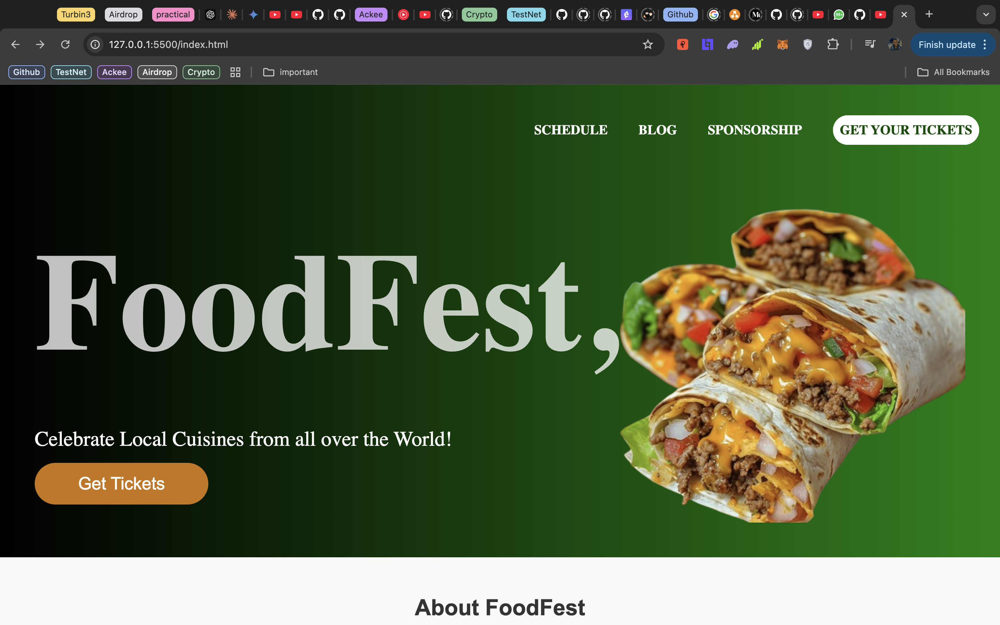
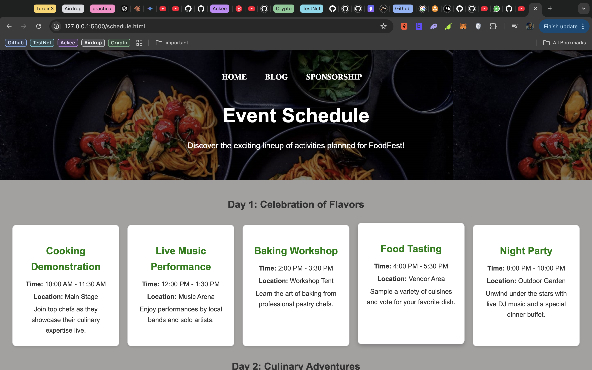

# FoodFest - Event Management Website

**FoodFest** is an event management website designed to celebrate and showcase local cuisine. This annual food festival website is built with React, TypeScript, and Tailwind CSS, featuring a DevFest-inspired design and optimized for an intuitive user experience. This website was built for the CIT 306 assignment under supervision of Engr. Doctor Amadi

## Table of Contents

- [Demo](#demo)
- [Features](#features)
- [Technologies Used](#technologies-used)
- [Project Structure](#project-structure)
- [Getting Started](#getting-started)
- [Screenshots](#screenshots)
- [Contributing](#contributing)
- [License](#license)

---

## Demo

**[Live Demo](URL_TO_LIVE_WEBSITE)** _(Add a link to your deployed site if available)_

## Features

- **Event Listing**: Display upcoming food events with details and schedules.
- **Vendor Directory**: Showcase participating vendors and their offerings.
- **Interactive Map**: A festival map with highlighted zones and vendor locations.
- **Tickets**: Ticket sales and registration forms.
- **Blog Section**: Updates and articles about the food festival.
- **FAQ & Contact**: Common questions and a contact form for inquiries.

## Technologies Used

- **Frontend**: React, TypeScript
- **Styling**: Tailwind CSS
- **Routing**: React Router
- **Icons**: Heroicons (via `@heroicons/react`)
- **Fonts**: Inter, PT Sans Narrow, and Poppins from Google Fonts

---

## Project Structure

Below is a high-level view of the directory structure of the FoodFest project:

```
/foodfest306
│   ├── assets/
│   ├── screenshots/
│   ├── blog.html
│   ├── contact.html
│   ├── index.html
│   ├── README.md
│   ├── schedule.html
│   └── script.js
│   └── style.css
```

See the [Folder Structure](#folder-structure) section for a detailed breakdown.

---

## Getting Started

To set up and run this project locally, follow these steps:

### Prerequisites

- **Node.js** (>= 14.x)
- **Chrome** or **Any chromium based browser**

### Installation

1. **Clone the Repository**:

   ```bash
   git clone https://github.com/Ororo1/FoodFest306.git
   cd foodfest
   ```

---

## Screenshots

### Homepage



### Event Schedule



---

## Contributing

If you'd like to contribute to FoodFest:

1. Fork the repository.
2. Create a new branch (`git checkout -b feature/YourFeature`).
3. Commit your changes (`git commit -m 'talk about your new feature'`).
4. Push to the branch (`git push origin feature/YourFeature`).
5. Open a pull request.

## License

This project is licensed under the MIT License - see the [LICENSE](LICENSE) file for details.

---

## Contact

For inquiries or support, please contact **[nwakanmadominion.20211274242](mailto:your-email@example.com)**.
